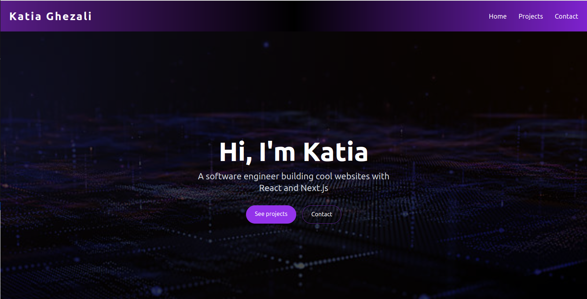
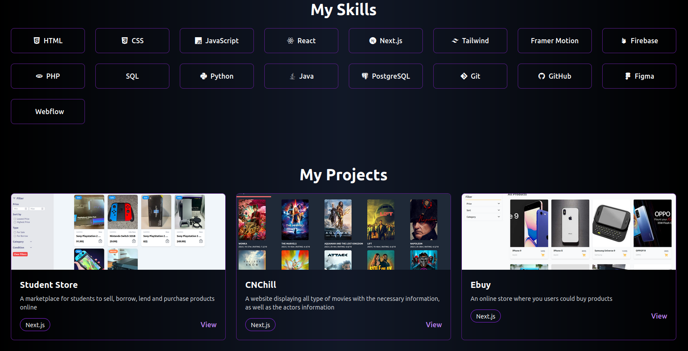
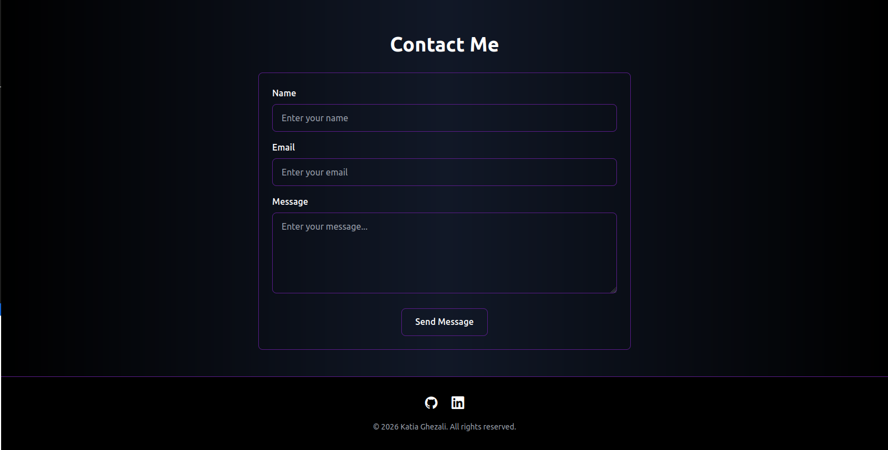
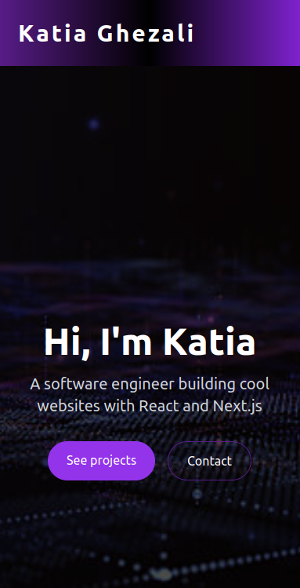
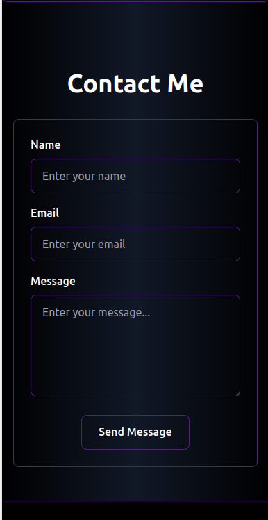

# Tailwind CSS Checkpoint

This project contains two responsive webpages built with **HTML and Tailwind CSS**:

- A personal portfolio
- An online blog landing page

The goal was to practice using Tailwind utility classes for layout, styling, responsiveness, cards, forms, and other UI components.

## 1. Personal Portfolio

A responsive portfolio webpage showcasing my introduction, skills, projects, and contact form.

### Screenshot

